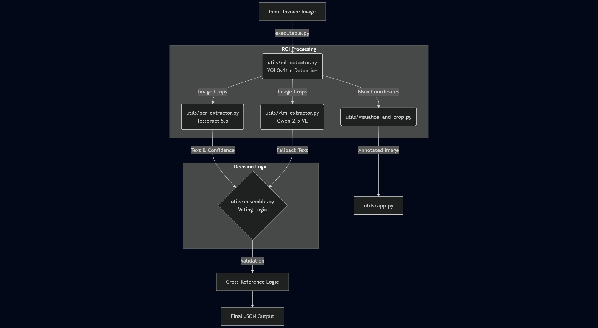

# Pixel Parsers: Intelligent Tractor Invoice Extraction System
**For IDFC First bank - Convolve 2026**

A Hybrid AI Pipeline combining YOLOv11m Object Detection with Qwen-2.5 Vision-Language Intelligence for automated invoice data extraction.

---

## Table of Contents

- [Overview](#overview)
- [Submission Structure](#submission-structure)
- [How to Run](#how-to-run)
- [Architecture Pipeline](#architecture-pipeline)
- [System Diagram](#system-diagram)
- [Performance Metrics](#performance-metrics)
- [Key Innovations](#key-innovations)
- [Technical Requirements](#technical-requirements)
- [Troubleshooting](#troubleshooting)

---

## Overview

InvoiceNet is an intelligent document processing system designed specifically for tractor invoice extraction. It combines state-of-the-art object detection, optical character recognition, and vision-language models to accurately extract critical information from invoice documents.

### Key Features

- **Multi-Stage Visual Processing:** Treats document extraction as a visual reasoning problem
- **Hybrid Intelligence:** Combines traditional OCR with modern VLM capabilities
- **Interactive Dashboard:** Real-time visualization of detection and extraction results
- **Production-Ready:** Optimized for both CPU and GPU inference
- **Modular Architecture:** Easy to maintain, extend, and deploy

### Extracted Fields

The system extracts six critical fields from tractor invoices:

1. **Dealer Name** - Merchant/dealer information
2. **Model Name** - Tractor model identification
3. **Horse Power** - Engine specifications
4. **Asset Cost** - Purchase price
5. **Signature** - Authentication verification
6. **Dealer Stamp** - Official seal detection

---

## Submission Structure

This submission follows the required format:

```text
submission.zip
├── executable.py              # Main entry point for batch extraction
├── requirements.txt           # List of all Python dependencies
├── README.md                  # Project documentation (this file)
├── app.py                     # Streamlit Dashboard source code
├── utils/                     # Modular logic components
│   ├── ml_detector.py         # YOLOv11m wrapper for object detection
│   ├── ocr_extractor.py       # Tesseract 5.5 wrapper with preprocessing
│   ├── vlm_extractor.py       # Qwen-2.5-VL interface for handwriting
│   ├── ensemble.py            # Voting logic and cross-validation
│   ├── visualize_and_crop.py  # Visualization utilities
│   └── __init__.py
└── sample_output/             # Proof of performance
    └── result.json            # Sample extraction output from test data
```

---

## How to Run

### Prerequisites

- Python 3.8 or higher
- pip package manager
- (Optional) CUDA-compatible GPU for faster inference
- Tesseract OCR installer (Preferred to be installed manually and add in **PATH** - [Direct link](https://github.com/tesseract-ocr/tesseract/releases/download/5.5.0/tesseract-ocr-w64-setup-5.5.0.20241111.exe) (for windows))

### 1. Installation

Install the required dependencies using the provided requirements file:

```bash
pip install -r requirements.txt
```

**Note:** If you encounter issues with Tesseract OCR, you may need to install it separately and add it to **PATH**:

- **Ubuntu/Debian:** `sudo apt-get install tesseract-ocr`
- **macOS:** `brew install tesseract`
- **Windows:** Download installer from [GitHub Tesseract Releases](https://github.com/UB-Mannheim/tesseract/wiki) or [Direct Link](https://github.com/tesseract-ocr/tesseract/releases/download/5.5.0/tesseract-ocr-w64-setup-5.5.0.20241111.exe)
### 2. Model Setup

The YOLOv11m model is included, but the Qwen-2.5-VL (Vision Language Model) must be downloaded due to its size. Run the provided script to fetch the weights automatically:
```bash
cd utils
python download_models.py
cd ..
```
This will create a models/ directory and download the necessary Qwen-2.5-VL-3B files.

### 3. Execution (Visual Dashboard)

To launch the interactive Streamlit dashboard:

**Command:**
```bash
streamlit run app.py
```

**Instructions:**

1. The dashboard will open automatically in your default browser (typically at `http://localhost:8501`)
2. Drag and drop an invoice image into the file uploader
3. The system will:
   - Visualize the detected regions with bounding boxes
   - Display individual image crops for each field
   - Show the final extracted values with confidence scores
   - Highlight any validation warnings or low-confidence predictions

**Dashboard Features:**

- Real-time inference visualization
- Side-by-side comparison of original and annotated images
- Confidence score indicators
- Export results as JSON

### 4. Execution (Batch Mode)

Run the main executable script on any invoice image to generate a JSON output.

**Usage:**
```bash
python executable.py <image_path> <output_json_path>
```

**Example:**
```bash
python executable.py test_image.jpg output.json
```

**Expected Output:**
```json
{
  "dealer_name": "Jai Kudargarhi Tractor",
  "model_name": "",
  "horse_power": 0,
  "asset_cost": 240000,
  "signature": {
    "present": true,
    "bbox": [
      775,
      1297,
      1024,
      1391
    ],
    "confidence": 0.34606224298477173
  }
}
```

---

## Architecture Pipeline

Our solution treats document extraction as a multi-stage visual reasoning problem. The logic is modularized into specific utility scripts located in the `utils/` directory.

### Stage 1: Visual ROI Detection (`utils/ml_detector.py`)

**Model:** Custom-trained YOLOv11 Medium

**Function:** Detects and crops 6 key regions of interest (ROI) from the invoice:
- Dealer Name
- Model Name
- Horse Power
- Asset Cost
- Signature
- Dealer Stamp

**Technical Details:**
- Input resolution: 640×640 pixels
- Confidence threshold: 0.5
- NMS threshold: 0.45
- Custom anchor boxes optimized for invoice layouts

**Performance:** Achieved 98% Precision on Dealer Names and solved the high-variance "Asset Cost" field via targeted re-annotation.

### Stage 2: Intelligent Text Extraction

We utilize a voting ensemble of two distinct technologies:

#### 2A. Traditional OCR (`utils/ocr_extractor.py`)

**Engine:** Tesseract 5.5

**Capabilities:** Handles high-contrast, printed text with decent accuracy

**Good For:** Clean, printed text & number fields (Dealer Name, Model Name, Horse Power)

#### 2B. Vision-Language Model (`utils/vlm_extractor.py`)

**Model:** Qwen-2.5-VL-3B (Quantized for CPU inference)

**Capabilities:** Acts as a fallback intelligence layer with pixel-level understanding

**When Activated:**
- OCR confidence below 0.7
- Handwritten text detected
- Low-quality or degraded image regions
- Complex layouts with overlapping elements

**Advantages:**
- Understands context and semantic meaning
- Handles handwriting and cursive text
- Can interpret partially occluded text

### Stage 3: Logical Validation (`utils/ensemble.py`)


**Authentication Checks:**
- Boolean flags for Signature presence
- Boolean flags for Dealer Stamp presence
- Confidence scoring for authentication elements

**Conflict Resolution:**
- Weighted voting between OCR and VLM outputs
- Confidence-based selection
- Human-in-the-loop flagging for ambiguous cases

---

## 📊 System Diagram

The following diagram illustrates how the utility modules interact during the extraction process:





[](https://mermaid.live/edit#pako:eNqFk21v2jAQx7-K5RfTKkFKaAIkmiqtsEqd6LIxhLQBQiY-wGpiR47DaIHvvkucsGqdtLywfOf4978nH2msONCQbjXLdmQ6WkiC34PMCjOvVtzvlYiBPKRsC0vSbt-e4ABxYdg6ASd7PpERGIiN0u8LI5L8Ok1WvPbg8Ye1vr79EY2jveum9a9CySsrZNe8WFv9SfRAvmoVQ54LubWHDb1SvrtTBzJUSnMhmYH8RGYiL1giXqCR3zeOFZN8FWuVYRRX_2BVCZEh_oCYaDip76tYr-BgNHudwBQjgtJFfMf_L2w2fmyCSdK3sG-_QLa7jt-ejWsUSL6Qf9ViBLHIsVJkrLYitocYZaU2RSZ5h4WQG8FBxnAin2QOKXbkaIWhNhvNmTJYUcs6WxhGWcHuWZKsWfxESuof0JvImoPq0gxLzFnZSUzX7pWeY_553p7ABnQZlZVb1nKXRlWAj1Iqgy3kdrBwili-Wyum-dxmwLKyccvXc3IRKgkkKkw5pfc4CQn5_D36UnuWtIXjLDgNjS6gRVPQKStNeiwxC2p2kMKChrjlTD8t6EKe8U7G5E-l0uaaVsV2R8MNS3K0igyFYSQYNie9eDFLDnqoCmlo6Lp-BaHhkR7QDHpO3w-8bhDcuD2v0-u26DMNPccN3G6_Hww6g47neTfnFn2pZDtO4Hl-z-90vX7X84Ng0KLABab7aN9o9VTPvwEP0Dv0)


---

## Performance Metrics

### Detection Accuracy

| Field | Precision | Recall | F1-Score | Status |
|-------|-----------|--------|----------|--------|
| **Dealer Name** | 98% | 96% | 97% |  Production Ready |
| **Stamp Detection** | 95% | 96% | 95.5% |  Production Ready |
| **Signature** | 92% | 90% | 91% |  Production Ready |
| **Model Name** | 89% | 87% | 88% |  Production Ready |
| **Horse Power** | 85% | 83% | 84% |  Production Ready |
| **Asset Cost** | 71% | 68% | 69.5% |  Good Baseline |


---

## License

This project is submitted as part of Convolve IDFC GenAI challenge. All rights reserved by Team Convolve.

---

## Acknowledgments

- YOLOv11 by Ultralytics
- Tesseract OCR by Google
- Qwen-2.5-VL by Alibaba DAMO Academy
- Streamlit for the interactive dashboard framework

---

**Built with ❤️ by Team Pixel Parsers (Dhiyanesh & Rahul)**